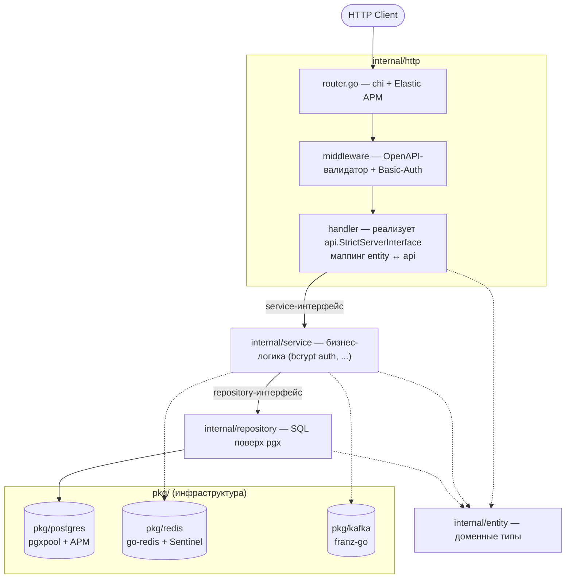
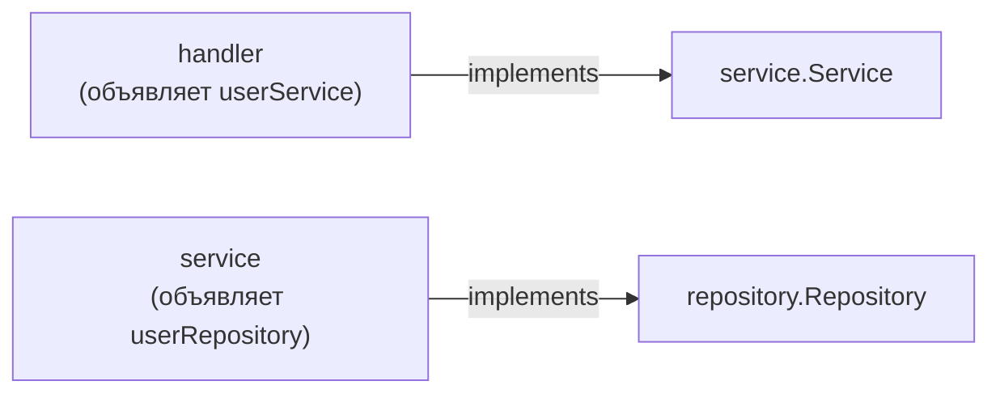
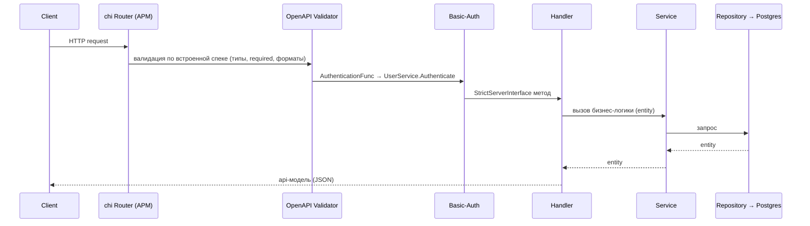
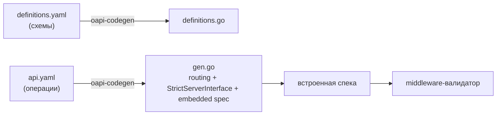
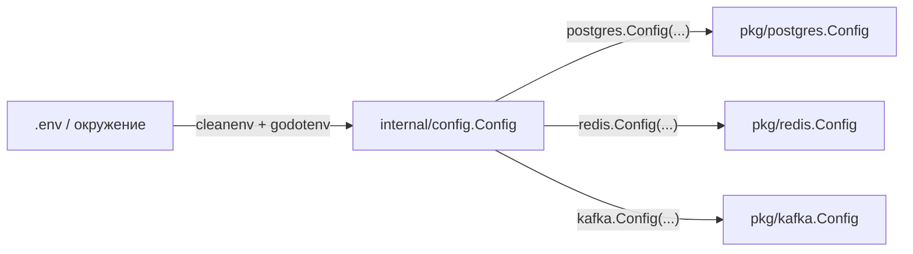

# Архитектура

`arche` построен на чистой слоёной архитектуре: каждый слой зависит только «внутрь»
и общается со следующим через интерфейс, объявленный **на стороне потребителя**.
HTTP-контракт задаётся OpenAPI-спекой и является источником истины.

## Композиционный корень

Вся сборка зависимостей происходит в [`internal/app/app.go`](../internal/app/app.go) (`Run`).
Это единственное место, где слои «сшиваются» вместе:

```
config → infra (pkg/postgres, pkg/redis) → repository → service → handler → router → http.Server
```

Сервер поднимается с graceful shutdown по `SIGINT` / `SIGTERM`
(таймаут — `HTTP_SHUTDOWN_TIMEOUT`).

## Слои



Сплошные стрелки — поток вызова, пунктирные — работа с доменными типами / инфраструктурой.

| Слой | Пакет | Ответственность | Зависит от |
| --- | --- | --- | --- |
| Router | `internal/http` | chi-роутер, middleware, обёртка Elastic APM | — |
| Middleware | `internal/http/middleware` | Валидация запроса из встроенной спеки + Basic-Auth | `UserService` (для auth) |
| Handler | `internal/http/handler` | Реализует сгенерированный `api.StrictServerInterface`, маппит `entity` ↔ `api` | service-интерфейс |
| Service | `internal/service` | Бизнес-логика (напр. bcrypt-аутентификация) | repository-интерфейс |
| Repository | `internal/repository` | SQL поверх `*postgres.Pool`, возвращает `entity`-типы | `pkg/postgres` |
| Entity | `internal/entity` | Доменные типы | — |

### Интерфейсы на стороне потребителя

Ключевое соглашение: интерфейсы (`userService`, `userRepository`, `userAuthenticator`)
объявляются в пакете, который их **использует**, а не там, где они реализованы.
Это держит зависимости направленными внутрь и упрощает подмену/мокинг в тестах.



## Поток HTTP-запроса



Валидация и аутентификация происходят **до** хендлера — в
[`middleware/validator.go`](../internal/http/middleware/validator.go), собранном из
встроенной OpenAPI-спеки. Поэтому в коде хендлеров не нужно повторно проверять типы,
`required` и форматы — ограничения выражаются в YAML.

## OpenAPI design-first



- Правим только `.yaml`, затем `make generate`. Файлы `generated/api/*.go`
  перезаписываются — **править руками нельзя**.
- Опции кодогенерации: `generated/api/cfg.yaml`, `definitions-cfg.yaml`
  (strict-server, chi, embedded-spec, nullable-type).
- Полный пример добавления эндпоинта — в [OAPI_GUIDE.md](../OAPI_GUIDE.md).

## Конфигурация: зеркало pkg ↔ internal/config

Пакеты в `pkg/` ничего не знают про `internal/*` и переменные окружения — вызывающий
заполняет `Config`-структуру и передаёт её. `internal/config` **зеркалит** каждую
`pkg`-структуру `Config` один-к-одному, чтобы `app.go` делал прямые преобразования вида
`postgres.Config(cfg.Postgres)`. Если поля разойдутся — сломается компиляция
(намеренная защита от рассинхрона).



## Инфраструктурные пакеты (`pkg/`)

| Пакет | Что даёт | Особенности |
| --- | --- | --- |
| `pkg/postgres` | Обёртка над pgxpool | Инструментирован Elastic APM (`apmpgxv5`); `Pool` = алиас `*pgxpool.Pool` |
| `pkg/kafka` | Обёртка над franz-go | Producer: гарантированная доставка (`acks=all`, идемпотентный, sync). Consumer: at-least-once (авто-коммит выключен, коммит после обработки) → **хендлеры обязаны быть идемпотентны**. См. [pkg/kafka/README.md](../pkg/kafka/README.md) |
| `pkg/redis` | Обёртка над go-redis | Опциональный Sentinel, префикс ключей |
| `pkg/logger` | Обёртка над slog | Корреляция с Elastic APM (`apmslog`) |
| `pkg/money` | Денежный тип с учётом валюты | На базе `bojanz/currency` |

## Observability

Elastic APM подключён на уровне HTTP (`apmhttp`), Postgres (`apmpgxv5`) и логов (`apmslog`),
что даёт сквозную трассировку запросов с корреляцией логов. Настраивается стандартными
переменными `ELASTIC_APM_*`; локально их можно оставить пустыми.

## CLI

[`cmd/cli`](../cmd/cli) — приложение на Cobra. Общие зависимости (пул Postgres)
открываются в `PersistentPreRunE` корневой команды и закрываются в `PersistentPostRun`
(см. `cmd/cli/deps`). Поддомены — в `cmd/cli/<domain>/` (напр. `user`).
